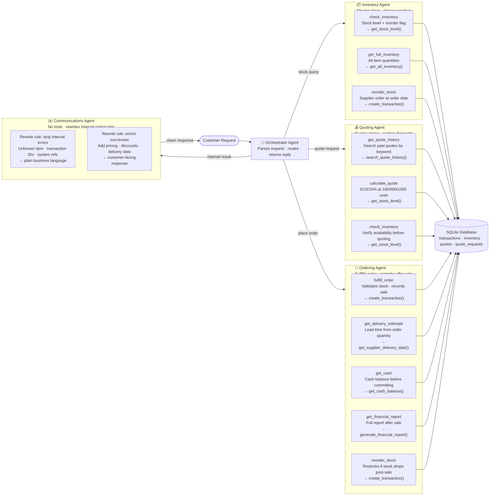

# 🎓 Udacity Nanodegree Projects Portfolio

A collection of projects completed as part of Udacity's Nanodegree programs, spanning **Agentic AI**, **Computer Vision**, and **Generative AI**.

---

## 📚 Nanodegree Programs

### 🤖 Agentic AI

Projects focused on building autonomous AI agents capable of reasoning, planning, and taking actions to complete multi-step tasks.

| # | Project | Description |
|---|---------|-------------|
| 1 | **Paper Company Sales Team** | Built a multi-agent sales team simulation to automate and coordinate sales workflows |
| 2 | **AgentsVille Trip Planner** | Developed an AI-powered travel planning agent that creates personalized trip itineraries |
| 3 | **An AI Research Agent for the Video Game Industry** | Created a research agent that autonomously gathers, analyzes, and summarizes video game industry data |
| 4 | **AI-Powered Agentic Workflow** | Designed a multi-phase agentic pipeline with modular workflow agents, testing suites, and orchestration logic |

---

### 👁️ Computer Vision Nanodegree

Projects covering the full spectrum of computer vision — from classical techniques to modern deep learning approaches.

| # | Project | Description |
|---|---------|-------------|
| 1 | **Image Classifier** | Built an image classification model to identify categories from visual input using deep learning |
| 2 | **Facial Keypoint Detection** | Trained a CNN to detect and localize facial keypoints on images using PyTorch |
| 3 | **Image Captioning** | Combined a CNN encoder with an RNN/LSTM decoder to automatically generate descriptive captions for images |
| 4 | **Landmark Detection & Robot Tracking (SLAM)** | Implemented Simultaneous Localization and Mapping (SLAM) to track a robot's position and build an environment map |

---

### 🎨 Generative AI

Projects exploring generative models — building systems that create, edit, and personalize content using state-of-the-art AI techniques.

| # | Project | Description |
|---|---------|-------------|
| 1 | **Apply Lightweight Fine-Tuning to a Foundation Model** | Fine-tuned a pre-trained LLM using parameter-efficient methods (PEFT / LoRA) for a custom downstream task |
| 2 | **AI Photo Editing with Inpainting** | Used diffusion models to perform context-aware image inpainting and intelligent photo editing |
| 3 | **Personalized Real Estate Agent** | Built an AI agent that generates personalized property recommendations using LLMs and a local vector database |

---

## 🔍 Project Spotlight — Paper Company Sales Team

A multi-agent AI system simulating a fully automated B2B paper sales operation. Customer requests are parsed and routed by a central **Orchestrator Agent** to one of three specialist agents, with all responses cleaned and formatted by a **Communications Agent** before reaching the customer.

### Agent Architecture

| Agent | Role | Tools |
|-------|------|-------|
| **Orchestrator** | Parses incoming requests and routes to the right agent | — |
| **Inventory** | Checks stock levels, triggers supplier reorders | `check_inventory`, `get_full_inventory`, `reorder_stock` |
| **Quoting** | Generates tiered price quotes (5/10/15% at 100/500/1000 units) | `get_quote_history`, `calculate_quote`, `check_inventory` |
| **Ordering** | Validates and fulfills sales, checks cash, generates reports | `fulfill_order`, `get_delivery_estimate`, `get_cash`, `get_financial_report`, `reorder_stock` |
| **Communications** | Strips internal errors and rewrites all output into plain business language | — |

All agents share a **SQLite database** storing transactions, inventory, quotes, and quote requests.

### Agent Flow



---
 

---

## 🛠️ Tech Stack

- **Languages:** Python
- **Frameworks & Libraries:** PyTorch, Hugging Face Transformers, LangChain, OpenCV, PEFT
- **Tools:** Jupyter Notebooks, Git
- **Models & APIs:** OpenAI API, Stable Diffusion, CLIP, BERT, GPT

---

## 🚀 Getting Started

Each project lives in its own subdirectory. Navigate into a project folder and install its dependencies to get started.

```bash
# Clone the repository

# Navigate to a project
cd "Generative AI/Personalized Real Estate Agent"

# Install dependencies
pip install -r requirements.txt
```

---
